**Vehicle Detection Project**

The goals / steps of this project are the following:

* Perform a Histogram of Oriented Gradients (HOG) feature extraction on a labeled training set of images and train a classifier Linear SVM classifier
* Optionally, you can also apply a color transform and append binned color features, as well as histograms of color, to your HOG feature vector. 
* Note: for those first two steps don't forget to normalize your features and randomize a selection for training and testing.
* Implement a sliding-window technique and use your trained classifier to search for vehicles in images.
* Run your pipeline on a video stream (start with the test_video.mp4 and later implement on full project_video.mp4) and create a heat map of recurring detections frame by frame to reject outliers and follow detected vehicles.
* Estimate a bounding box for vehicles detected.

[//]: # (Image References)
[image1]: ./examples/car_not_car.png
[image2]: ./examples/HOG_example.jpg
[image3]: ./examples/sliding_windows.jpg
[image4]: ./examples/sliding_window.jpg
[image5]: ./examples/bboxes_and_heat.png
[image6]: ./examples/labels_map.png
[image7]: ./examples/output_bboxes.png
[video1]: ./project_video.mp4

## [Rubric Points](https://review.udacity.com/#!/rubrics/513/view)
### Here I will consider the rubric points individually and describe how I addressed each point in my implementation.  

---
### Histogram of Oriented Gradients (HOG)

#### 1. Explain how (and identify where in your code) you extracted HOG features from the training images.

I started by reading in all the `vehicle` and `non-vehicle` images.  Here is an example of one of each of the `vehicle` and `non-vehicle` classes:

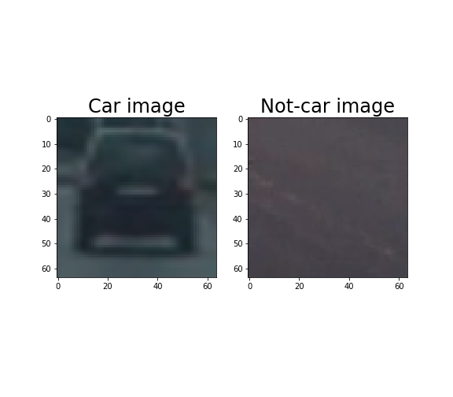

The code to extract HOG features is contained in the helper function extract_features() in the 2nd code cell of the IPython notebook.

Here is an example of a HOG visualization of a car image in the dataset with parameters orient=8, pix_per_cell=8, cell_per_block=2:

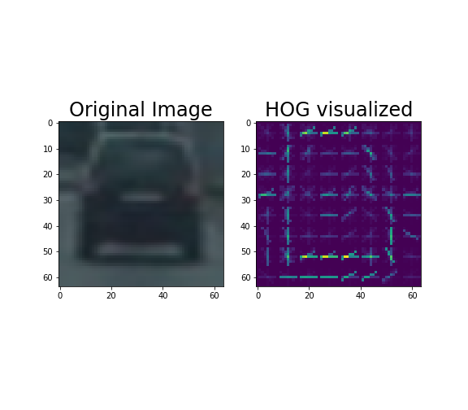

I then explored different color spaces for feature extraction.  I grabbed random images from each of the two classes and displayed them in these color spaces in order to get a feel which one might be most useful as features to saperate between the car/not-car images:
1) RGB
2) HSV
3) LUV
4) YCrCb
5) YUV

Here is an example of color spaces of a random car image:

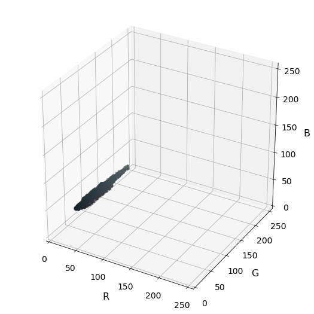
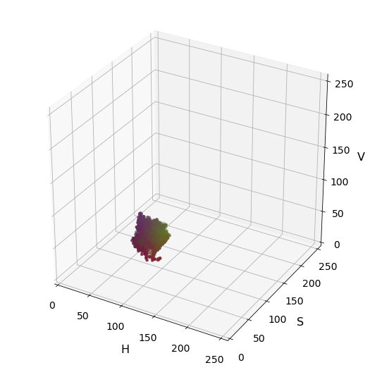
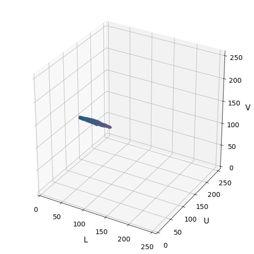
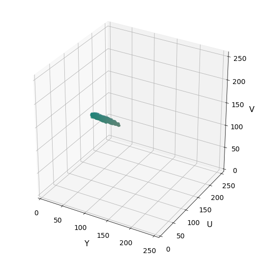
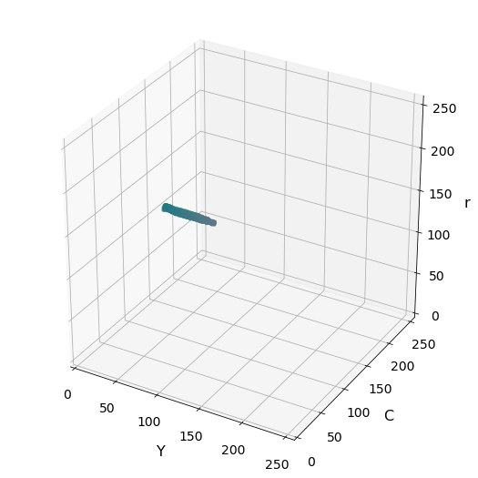

Here is an example of color spaces of a random not-car image:

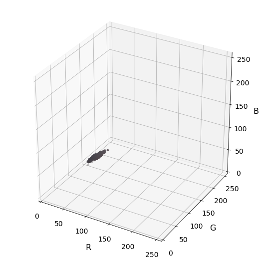
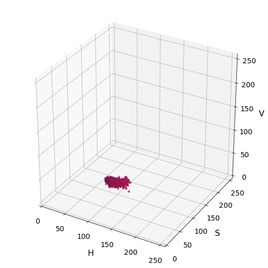
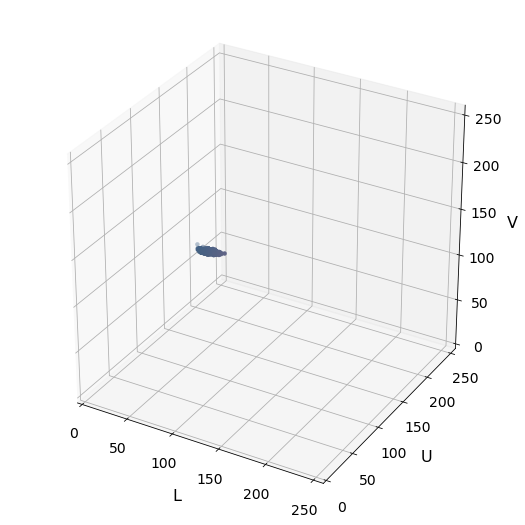
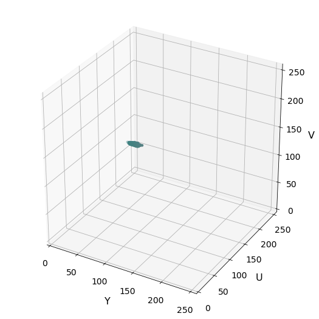

From the visualization, honestly I can't make up which color space would be best to use to as features to differentiate between cars/not-cars images, they all seem to be able to differentiate cars/not-cars, but none really stand out as better than the other to me. So I will do trial-and-error with each one of them to get highest accuracy on the validation set. 

####2. Explain how you settled on your final choice of HOG parameters.

Firstly I try to visualize how three different combinations of the HOG parameters looks like, in order to get a feel for what the `skimage.hog()` output looks like for each of them, and how they might affect the accuracy of the classifier.

Here are the HOG visualized of a random car image for different Orient, Pix/Cell, Cells/block, and Channel parameters:

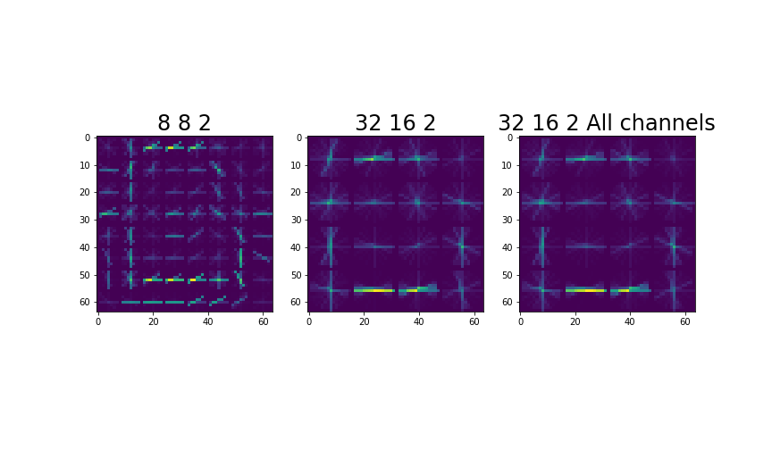

This is the same procedure for a random not-car image:

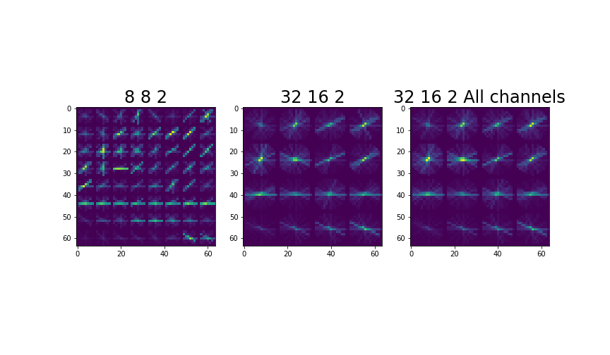

Looks to me the bigger Orient, Pix/Cell, Cells/block might make better features as there are less blocks that look the same between car/not-car, thus might result in less false positive detection.

Anyhow, I proceed with trial-and-error a few parameters to get the highest accuracy, and here is the result:

| Orient | Pixels/cell   | Cells/block | Color space | Accuracy|
|:------:|:-------------:|:-----------:|:-----------:|--------:|
| 8      | 8             |   2         |   RGB       | 95.7    |
| 8      | 8             |   2         |   YUV       | 96.5    |
| 8      | 8             |   2         |   YCrCb     | 96.9    |
| 32     | 16            |   2         |   YCrCb     | 98.6    |

Final parameters settings: 
color_space = 'YCrCb' # Can be RGB, HSV, LUV, HLS, YUV, YCrCb  
spatial_size = (32, 32) # Spatial binning dimensions 
hist_bins = 16    # Number of histogram bins 
 
orient = 32  # HOG orientations 
pix_per_cell = 16 # HOG pixels per cell 
cell_per_block = 2 # HOG cells per block 
hog_channel = 'ALL' 

#### 3. Describe how (and identify where in your code) you trained a classifier using your selected HOG features (and color features if you used them).

In code cell 12, I trained a linear SVM using LinearSVC.

### Sliding Window Search

#### 1. Describe how (and identify where in your code) you implemented a sliding window search.  How did you decide what scales to search and how much to overlap windows?

I decided to use sliding window search with 3 different scales as can be seen below:

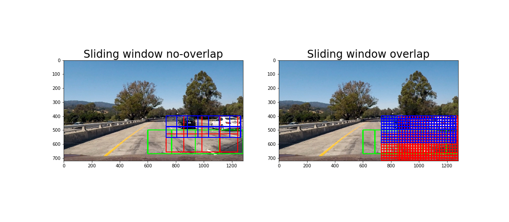

The left image are the windows with no overlap, so that it is easier to see the size of the windows. The idea of using the 3 scales is very simple: Objects (Cars) appear bigger when they are nearer to the camera and gradually become smaller as they go farther. Thus the biggest scale windows (green) is put at the lowest end of the image, the middle scale windows (red) are at the middle of the image, and the smallest scale windows (blue) are at the upper end of the road where the cars will appear smallest. 

Note: I use high overlapping so that I can filter out false positive when we generate heatmap later.

The final parameters of the window search is as below:
 
xy_windows = [(170, 170),(128, 128),(76, 76)] 
overlaps = [0.50, 0.85, 0.75] 
y_start_stops = [[500, 720],[400,720],[400,600]] 
x_start_stops = [[600, 1280],[730, 1280],[730, 1280]] 
colors = [(0,255,0), (255,0,0), (0,0,255), (0,128,128), (128,0,128)] 

#### 2. Show some examples of test images to demonstrate how your pipeline is working.  What did you do to optimize the performance of your classifier?

Ultimately I searched on two scales using YCrCb 3-channel HOG features plus spatially binned color and histograms of color in the feature vector, which provided a nice result.  Here are some example images:

For optimization of the performance of the classifier, this has already been described in question 2 (HOG parameters tuning) above.
---

### Video Implementation

#### 1. Provide a link to your final video output.  Your pipeline should perform reasonably well on the entire project video (somewhat wobbly or unstable bounding boxes are ok as long as you are identifying the vehicles most of the time with minimal false positives.)
Here's a [link to my video result](./output_v8.mp4)

#### 2. Describe how (and identify where in your code) you implemented some kind of filter for false positives and some method for combining overlapping bounding boxes.

I recorded the positions of positive detections in each frame of the video.  From the positive detections I created a heatmap and then thresholded that map to identify vehicle positions.  I then used `scipy.ndimage.measurements.label()` to identify individual blobs in the heatmap.  I then assumed each blob corresponded to a vehicle, with a treshold of 4.  I constructed bounding boxes to cover the area of each blob detected.

Here's an example result showing the heatmap from a series of frames of video, the result of `scipy.ndimage.measurements.label()` and the bounding boxes then overlaid on the last frame of video:

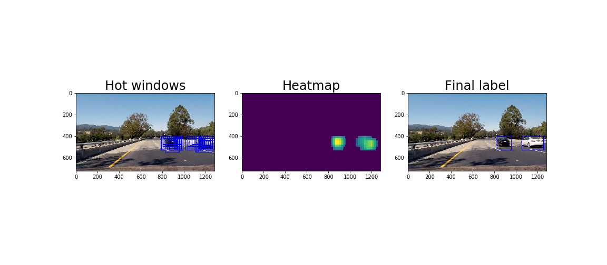
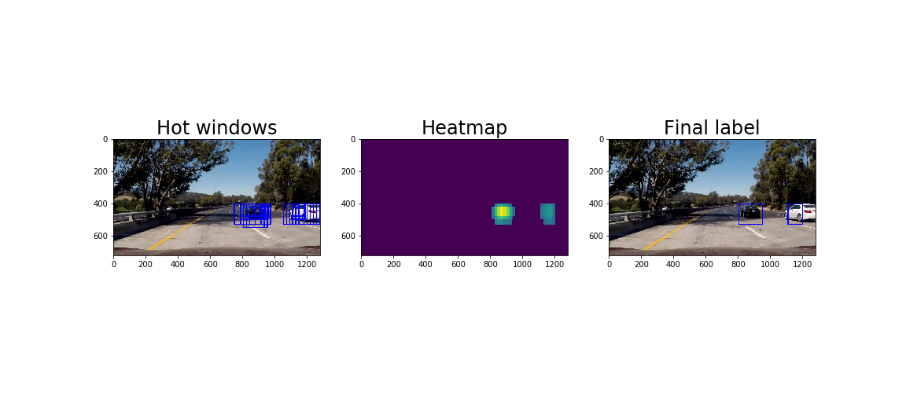
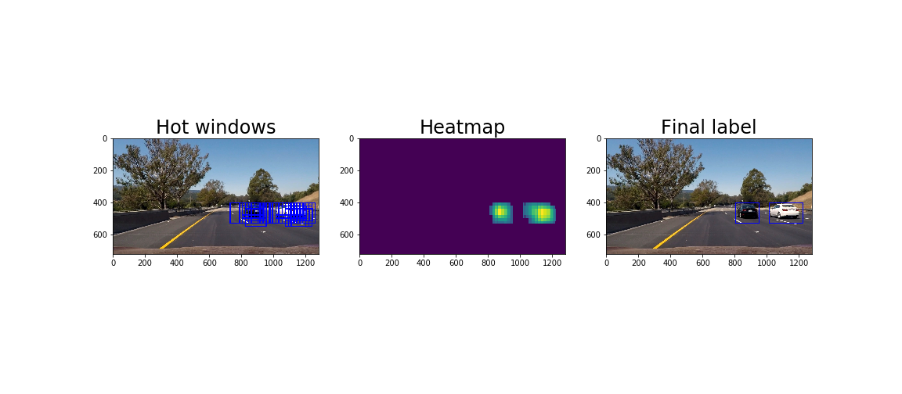

---

### Discussion

#### 1. Briefly discuss any problems / issues you faced in your implementation of this project.  Where will your pipeline likely fail?  What could you do to make it more robust?

My pipeline will likely to fail in the below scenarios:
1. The self-driving car is driving on right most lanes, and the cars it should detect will now be on the left lane. The way the sliding window is implemented is that it will search only on certain pixel x+, as to prevent it from finding cars on the opposite side of the highway

2. A vehicle that is of extreme size (whether big or small) will most likely not be detected, as the sliding window has a fixed size, such that we expect the size of the vehicle to be about the same, within its range.

3. Other types of vehicle, like motorcycle, busses, etc will most likely not be detected as the training set is only filled with cars.

How to make it more robust:
1. We can implement a sliding window that spans accros the full horizontal width of the camera image, providing we also put in the self-driving a mechanism to detect barrier and understand beyond it whatever cars there does not concern it.

2. We can add many more scales of sliding windows however this might make a real-time inferencing too slow for real-world scenario, so we should use a full end-to-end neural network for object detection that is fast, such as YOLO (darknet/darkflow).

3. Add to the training set pictures of other types of vehicles such as trucks, busses, motorcycles, etc so that it can detect all types of vehicles

